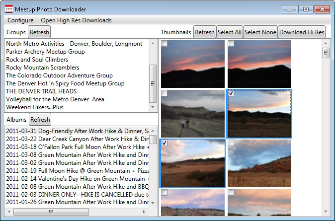

# Meetup Photo Downloader (MPDL) #

# Easy Photo Downloader Launched!

The functionality of MPDL has been recreated as a commercial application.

[Purchase Easy Photo Downloader](https://easydownload.photos/)

[More Information](http://www.coderken.com/meetup/photo/downloader/mpdl/easy/download/2018/03/09/easy-photo-download-launched.html#)




```diff
- WARNING: MPDL has unofficially not been supported for some time. 
- Officially, MPDL is no longer supported.
- 
- Hower, the functionality of MPDL IS supported in 
- Easy Photo Downloader
```

## Description ##
Meetup Photo Download (MPDL) was created to assist Meetup.com members in bulk download of photo albums.

## Features ##
  * Bulk selection, preview, and download of High Res photos.
  * Local caching of group, album, and thumbnail information with the option to refresh from meetup.com at any time.
  * Meetup.com account information exchange via https (photos are downloaded via http).

## Limitations ##
  * Can only download from groups to which you are a member.
  * Tested with UAC disabled.  Some have reported having to use Run as Administrator or compatibility mode options on Windows Vista/7.
  * Meetup.com limits the amount of requests to 200/hour.  These limits have not been tested and are not checked for at current.  Note: This does not mean you can only download 200 photos/hour.

## Prerequisites ##
  * .NET Framework 3.5 SP1: http://www.microsoft.com/downloads/en/details.aspx?FamilyID=ab99342f-5d1a-413d-8319-81da479ab0d7

## Tested Platforms ##
  * Windows 7 64-bit
  * Windows 7 32-bit

## Installation ##
  * Download zipped __Release__ archive.
  * If needed, unblock archive (Right click on archive in Windows Explorer, select **Properties** | **Unblock** | **OK**)
  * Extract archive.

## Usage ##
  * Run MPDL.UI.exe
  * Provide requested API Key, while heeding the security warning (see below for detail).
  * Note: Nothing is downloaded from Meetup.com until requested by a click.
  * Click **Refresh** next to _Groups_ to download your group information.
  * Select Group and Album to download from (use Refresh buttons if displayed information is stale).
  * Browse and select from the list of thumbnails.
  * Click **Download Hi Res**
  * Click **Open High Res Downloads** on the menu to more quickly open the output folder.

## Notes ##
  * All downloaded content is stored in _./cache_ .  Depending on your usage, periodic purging/management of this folder may be required to recover disk space.
  * Configuration is stored in _./config.xml_ . Delete this file if you suspect it has become corrupt or to remove meetup.com "credentials".

## Locating your API Key ##
This is probably the most complex step in getting the application to function properly.  Unfortunately, I can't think of a way to make it any easier at the moment.  You must provide your valid API Key.  This is NOT your meetup.com username or password.

This information is subject to change, since Meetup.com is ever-evolving.
  * Login to meetup.com
  * Click **Account** (top-right)
  * Click **Connected Apps** (left menu)
  * Click the **API Key** link.
  * Your API key is the string of characters displayed in bold and is currently a hexadecimal string of 32 characters, similar to 1a123456789012345a1234a1234567a.

Note: Do not share this information with others!

## Support ##
Please report any problems using the _Issues_ link above.
